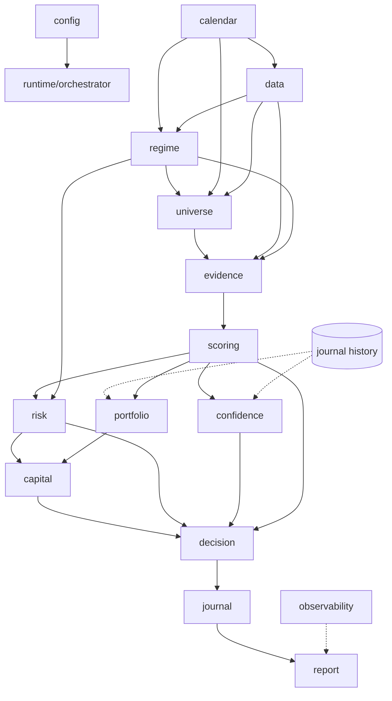

# ATHENA-002 — System Blueprint

| | |
|---|---|
| Version | 1.1 |
| Status | **APPROVED — ARCHITECTURE FROZEN** (per ATHENA-002R). Changes only via ADR (§19). Phase 0 authorized. |
| Governed by | ATHENA-000 v0.2 (Constitution), ATHENA-001 (Engineering Review), ATHENA-001R + ATHENA-002R (Owner Reviews) |
| Scope | Single source of truth for implementation: architecture, domain model, schema, contracts, lifecycle, standards, roadmap |
| Horizon | **Intraday-first** (v1) on NSE cash equities; swing later; options/positional in expansion |

---

## 1. System Overview

ATHENA is a single-process **modular monolith** running on one machine. Each trading session it: establishes market context (calendar + regime), constructs today's universe, gathers Evidence, scores opportunities, applies risk gates, emits structured Decisions with full explanations, journals every recommendation, and renders a dashboard. A pre-market planning run precedes the session; periodic refresh cycles re-evaluate during market hours. Every run is deterministic, auditable, and replayable.

Two invariants shape everything below:

- **Explainability is data.** Evidence, Score, and Decision objects carry their own rationale. Nothing renders an explanation that wasn't recorded at decision time.
- **Replayability is storage.** Inputs, config snapshot, evidence chain, and software version are persisted per run; any historical recommendation can be reconstructed exactly (ATHENA-000 principle 8).

## 2. Module Map

Seventeen modules in four layers (v1.1, per ATHENA-002R — **this map is frozen**; additions require an ADR). Every module: one responsibility, explicit inputs/outputs, replaceable behind a Protocol, toggleable by feature flag where marked ⚑ (F-9).

| Layer | Module | Responsibility (one sentence) |
|---|---|---|
| Core | `domain` | Canonical immutable objects — the contracts between all modules; pure, no I/O. |
| Core | `config` | Load, validate (pydantic), snapshot, and version all configuration; strategy profiles; feature flags. |
| Core | `runtime` | Orchestrate cycles, own RunRecords, PipelineContext, determinism, replay, and simulation mode (F-16). |
| Core | `observability` | Metrics: module latency, provider latency, data freshness, throughput, refresh/dashboard durations; enforce performance budgets (F-7, F-11). |
| Context | `calendar` | Trading Calendar Engine — sessions, holidays, expiries, events (R-3). |
| Context | `regime` | Market Regime Engine — classify market context AND emit Market Health + Sector Health scores before any scoring (R-2, F-5, F-6). |
| Context | `universe` | Dynamic Watchlist Engine — construct today's trading universe (R-4). |
| Intelligence | `data` | MarketDataProvider abstraction, ingestion, validation, storage. |
| Intelligence | `evidence` | Indicators/features → canonical Evidence objects (R-5). |
| Intelligence | `scoring` | Weighted, profile-driven Score from Evidence; per-factor attribution. |
| Intelligence | `confidence` ⚑ | Confidence Engine — empirical trust in scores, separate from scoring (R-7). |
| Intelligence | `risk` | Risk EVALUATION only (F-4): business rules, gates, NSE market structure, no-trade conditions. |
| Intelligence | `capital` | Capital Manager (F-3): daily/allocated/reserved/risk capital, buying power, per-sector/position caps, position sizing, execution constraints, margin awareness. |
| Intelligence | `portfolio` ⚑ | Portfolio Intelligence (F-2): sector exposure, open risk, correlation, cash availability, diversification, trade-conflict detection against existing positions. |
| Decision | `decision` | Compose Evidence + Score + Confidence + Risk + Capital + Portfolio into Decision objects (R-6); enforce the six quality gates (§8.5); emit DecisionTrace (F-15). |
| Decision | `journal` | Decision Journal — record every recommendation + user action + outcome (R-9). |
| Decision | `report` | Render dashboard and briefings from stored objects; renders only, never computes. |

Future modules (existing taxonomy, deferred): `learning` (Phase 6), `news` ⚑, `options` ⚑ (Phase 7). The `knowledge` base is the `docs/` tree plus journal-derived artifacts (R-10), not code in v1.

**Collaborative intelligence (R-12).** Modules do not call each other. Each cycle, the `runtime` orchestrator passes a shared, append-only **PipelineContext** through the modules; each module reads what it needs and contributes its output. Regime output influences risk; risk influences decision; decisions influence confidence calibration; learning (later) influences scoring weights — all through PipelineContext and stored domain objects, never through direct coupling. This same contract enables the event-driven evolution (§9.4) without rewrites.

## 3. Folder Structure

```
ATHENA/
├── CLAUDE.md                    # project rules (AGENTS.md symlinks to it)
├── AGENTS.md -> CLAUDE.md
├── README.md
├── pyproject.toml               # uv-managed; single source of dependencies
├── justfile                     # premarket / refresh / replay / test / backup targets
├── .env.example                 # documented secrets template (.env gitignored)
├── docs/                        # KNOWLEDGE BASE (R-10)
│   ├── ATHENA-000-Master-Architecture.md
│   ├── ATHENA-001-Engineering-Review.md
│   ├── ATHENA-001R-Owner-Review.md
│   ├── ATHENA-002-System-Blueprint.md
│   ├── adr/                     # Architecture Decision Records (F-14) — ADR-001…
│   ├── playbooks/               # market playbooks (expiry day, budget day, …)
│   ├── lessons/                 # failure analysis, lessons learned
│   └── releases/                # release notes per version
├── config/
│   ├── base.json                # app-level: paths, logging, refresh interval, feature flags (F-9)
│   ├── market.nse.json          # NSE structure: sessions, circuits, series, lot sizes
│   ├── calendar/                # holidays.json, expiries.json, events.json (data, not code)
│   ├── universe.json            # watchlist filter definitions (R-4)
│   ├── regime.json              # regime + market/sector health thresholds (R-2, F-5, F-6)
│   ├── risk.json                # risk-evaluation rules, no-trade conditions (F-4)
│   ├── capital.json             # capital manager: pools, caps, sizing (F-3)
│   ├── indicators.json          # indicator parameters + versions (F-13)
│   └── profiles/                # strategy profiles (F-10): momentum.json, orb.json, …
│                                #   each: indicators, weights, risk overrides, capital rules,
│                                #   sizing, trading windows; one active profile per run
├── src/athena/
│   ├── domain/                  # §4 — pure objects, zero dependencies on other layers
│   ├── config/
│   ├── runtime/                 # orchestrator.py, context.py, replay.py, run_record.py
│   ├── calendar/
│   ├── data/
│   │   ├── providers/           # base.py (Protocol), file_provider.py, <broker>_provider.py later
│   │   ├── validation/
│   │   └── store/               # SQLite access; the ONLY module that writes market data
│   ├── observability/           # metrics, budgets, system health (F-7, F-8, F-11)
│   ├── regime/
│   ├── universe/
│   ├── evidence/
│   │   └── indicators/          # in-house, one file per indicator, golden-tested, versioned
│   ├── scoring/
│   ├── confidence/
│   ├── risk/                    # evaluation only (F-4)
│   ├── capital/                 # capital manager + sizing (F-3)
│   ├── portfolio/               # portfolio intelligence (F-2)
│   ├── decision/
│   ├── journal/
│   └── report/
│       └── templates/           # static HTML templates + vanilla JS
├── tests/
│   ├── golden/                  # frozen datasets + expected outputs (ATHENA-001 T-3)
│   ├── unit/  integration/  contract/  # contract/: MarketDataProvider conformance
├── db/                          # athena.db + backups/   (gitignored)
├── logs/                        # JSONL logs              (gitignored)
└── exports/                     # generated dashboards    (gitignored)
```

Migration note: the four ATHENA-00x docs currently live at repo root; they move to `docs/` when this blueprint is approved (git commands supplied at that time).

## 4. Domain Model (R-13)

All objects are frozen dataclasses (or pydantic models where validation is needed), defined in `domain/`, importable by every module, importing from none. IDs are ULIDs; timestamps are timezone-aware IST; money/prices are `Decimal`.

| Object | Purpose | Key fields |
|---|---|---|
| `Instrument` | Tradable security identity | isin, symbol, exchange, series, lot_size, tick_size, status, listed/delisted dates |
| `Candle` | OHLCV bar, any timeframe | instrument_id, timeframe (1m/5m/15m/1d), ts_open, o/h/l/c, volume, source, adjusted flag |
| `CorporateAction` | Split/bonus/dividend/rename | instrument_id, type, ex_date, ratio/amount, raw details |
| `CalendarContext` | Today's market awareness | date, session_type (normal/holiday/muhurat/special), open/close times, expiry flags, events[] |
| `MarketSnapshot` | Index-level state at a moment | ts, index values, breadth, India-VIX, advance/decline, gap stats |
| `SectorSnapshot` | Sector-level state | ts, sector, relative strength, breadth, leaders[] |
| `RegimeAssessment` | Output of regime engine | ts, labels[] (e.g. BULL_TREND, GAP_UP, HIGH_VOLATILITY, EXPIRY_DAY), evidence_ids[], explanation |
| `Universe` | Today's trading universe | date, cycle_id, instrument_ids[], filter_trace per inclusion (why each symbol is in) |
| `Evidence` | Atomic observation (R-5) | id, category, source, ts, instrument_id?, raw_value, normalized_value, weight, confidence, explanation, metadata |
| `Signal` | Directional aggregation of Evidence | id, instrument_id, direction, strength, evidence_ids[], explanation |
| `Score` | Opportunity quality | instrument_id, total, per-factor breakdown{factor: points}, config_snapshot_id, evidence_ids[], explanation |
| `ConfidenceAssessment` | Historical trust in a score (R-7) | score_bucket, empirical_hit_rate, sample_size, method, explanation |
| `ExplainabilityReport` | Quality gate input (R-8) | decision_id, coverage (evidence-per-factor), completeness score, missing[] |
| `Decision` | Canonical recommendation (R-6) | id, ts, run_id, cycle_id, instrument_id?, type (TRADE/WATCH/WAIT/NO_TRADE/REDUCE/INCREASE/PARTIAL_EXIT/FULL_EXIT/AVOID_SECTOR/MARKET_CLOSED/INSUFFICIENT_DATA/DATA_VALIDATION_FAILED), direction?, score_ref, confidence_ref, risk_ref, explainability_ref, trade_plan?, explanation |
| `TradePlan` | Actionable plan attached to TRADE | entry zone, stop, targets[], position_size, risk_amount, risk_reward, validity window |
| `RiskEvaluation` | Risk engine verdict | decision_gate (pass/block + reason), limits state, exposure, sizing inputs |
| `Position` / `Portfolio` | Open positions and aggregate state | instrument, qty, avg price, MTM, realized/unrealized, exposure by sector |
| `DecisionJournalEntry` | Every recommendation + human response (R-9) | decision_id, market_context_ref, user_action (ACCEPTED/REJECTED/IGNORED), action_ts, outcome_ref? |
| `TradeOutcome` | Realized result for accepted decisions | entry/exit fills, pnl, holding time, adherence-to-plan flags |
| `MarketHealthScore` | Market quality inputs (F-5) | ts, components{trend_quality, breadth, liquidity, volatility, institutional_strength, gap_stability}, total, explanation |
| `SectorHealthScore` | Sector quality inputs (F-6) | ts, sector, components{momentum, leadership, relative_strength, participation, rotation}, total, explanation |
| `CapitalState` | Capital manager output (F-3) | daily/allocated/reserved/risk capital, buying power, per-sector and per-position caps, explanation |
| `DecisionTrace` | Complete reasoning path (F-15) | decision_id, ordered stage records (market → calendar → universe → evidence → score → confidence → risk → capital → decision → trade_plan) each with object refs + summary; the primary debugging and learning artifact |
| `SystemHealthReport` | Pre-flight self-check (F-8) | ts, checks{provider, database, config, data_freshness, storage, replay, last_successful_run, dashboard}, overall status, blocking issues[] |
| `RunRecord` | One pipeline execution | run_id, cycle_id, started/finished, trigger (premarket/refresh/replay/simulate), status, input data digest, and full version vector (F-13): software_version (git sha), blueprint_version, config_snapshot_id, strategy_profile + version, indicator_versions{} |
| `ConfigurationSnapshot` | Frozen config for a run | id, content hash, full JSON payload (incl. active profile + feature flags), created_ts |

Contract rule: **modules exchange only these objects.** Adding a field is a reviewed change (`docs`-typed commit referencing this section); removing/renaming one requires a blueprint amendment.

## 5. SQLite Schema

One file `db/athena.db`, WAL mode, `foreign_keys=ON`, single writer (the pipeline), readers never write. History tables are **append-only** — corrections happen by appending superseding rows, never UPDATE/DELETE on history.

```sql
-- Reference
CREATE TABLE instruments        (instrument_id TEXT PRIMARY KEY, isin TEXT, symbol TEXT NOT NULL,
                                 exchange TEXT, series TEXT, lot_size INTEGER, tick_size TEXT,
                                 status TEXT, listed_date TEXT, delisted_date TEXT);
CREATE TABLE corporate_actions  (id TEXT PRIMARY KEY, instrument_id TEXT REFERENCES instruments,
                                 type TEXT, ex_date TEXT, details_json TEXT);
CREATE TABLE calendar_events    (date TEXT, kind TEXT, details_json TEXT, PRIMARY KEY(date, kind));

-- Market data (append-only)
CREATE TABLE candles            (instrument_id TEXT, timeframe TEXT, ts_open TEXT,
                                 open TEXT, high TEXT, low TEXT, close TEXT, volume INTEGER,
                                 source TEXT, ingested_run_id TEXT,
                                 PRIMARY KEY(instrument_id, timeframe, ts_open));
CREATE TABLE market_snapshots   (ts TEXT PRIMARY KEY, payload_json TEXT);
CREATE TABLE sector_snapshots   (ts TEXT, sector TEXT, payload_json TEXT, PRIMARY KEY(ts, sector));

-- Run provenance (replayability, ATHENA-000 p8/p12)
CREATE TABLE config_snapshots   (id TEXT PRIMARY KEY, content_hash TEXT UNIQUE, payload_json TEXT, created_ts TEXT);
CREATE TABLE runs               (run_id TEXT PRIMARY KEY, cycle_id TEXT, trigger TEXT,
                                 started_ts TEXT, finished_ts TEXT, status TEXT,
                                 software_version TEXT, blueprint_version TEXT,
                                 strategy_profile TEXT, indicator_versions_json TEXT,
                                 config_snapshot_id TEXT REFERENCES config_snapshots,
                                 input_digest TEXT);
CREATE TABLE system_health      (id TEXT PRIMARY KEY, run_id TEXT, ts TEXT,
                                 checks_json TEXT, status TEXT);

-- Intelligence outputs (append-only, all carry run_id)
CREATE TABLE regime_assessments (id TEXT PRIMARY KEY, run_id TEXT, ts TEXT, labels_json TEXT, explanation TEXT);
CREATE TABLE universes          (id TEXT PRIMARY KEY, run_id TEXT, date TEXT, members_json TEXT);
CREATE TABLE evidence           (id TEXT PRIMARY KEY, run_id TEXT, instrument_id TEXT, category TEXT,
                                 source TEXT, ts TEXT, raw_value TEXT, normalized_value TEXT,
                                 weight TEXT, confidence TEXT, explanation TEXT, metadata_json TEXT);
CREATE TABLE scores             (id TEXT PRIMARY KEY, run_id TEXT, instrument_id TEXT, total TEXT,
                                 breakdown_json TEXT, evidence_ids_json TEXT, explanation TEXT);
CREATE TABLE decisions          (id TEXT PRIMARY KEY, run_id TEXT, cycle_id TEXT, ts TEXT,
                                 instrument_id TEXT, type TEXT, direction TEXT,
                                 score_id TEXT, confidence_json TEXT, risk_json TEXT,
                                 explainability_json TEXT, trade_plan_json TEXT, explanation TEXT);

CREATE TABLE decision_traces    (decision_id TEXT PRIMARY KEY REFERENCES decisions,
                                 trace_json TEXT);          -- ordered stage records (F-15)

-- Journal & outcomes (R-9)
CREATE TABLE decision_journal   (decision_id TEXT PRIMARY KEY REFERENCES decisions,
                                 user_action TEXT, action_ts TEXT, notes TEXT);
CREATE TABLE trade_outcomes     (id TEXT PRIMARY KEY, decision_id TEXT REFERENCES decisions,
                                 entry_json TEXT, exit_json TEXT, pnl TEXT, holding_seconds INTEGER,
                                 adherence_json TEXT, closed_ts TEXT);
CREATE TABLE positions          (id TEXT PRIMARY KEY, instrument_id TEXT, opened_ts TEXT, closed_ts TEXT,
                                 qty INTEGER, avg_price TEXT, meta_json TEXT);
```

Prices stored as TEXT (Decimal serialization) to avoid float drift — a deliberate trade-off of storage convenience for correctness. Backups: nightly `sqlite3 .backup` to `db/backups/` with 30-day rotation; restore is exercised by an integration test.

## 6. Configuration Architecture

Layered JSON (constitution's format choice, ATHENA-001 D-7), all loaded through pydantic models with cross-field invariant validation at startup — fail fast, human-readable errors.

- **Layer 1 — application** (`base.json`): paths, log level, refresh interval, dashboard port.
- **Layer 2 — market structure** (`market.nse.json`, `config/calendar/*`): sessions and timings, circuit bands, series, expiry schedule, lot sizes. Changes when the exchange changes rules, not when strategy changes.
- **Layer 3 — strategy** (`universe.json`, `regime.json`, `risk.json`, `capital.json`, `indicators.json`): everything the trader tunes. Every threshold ATHENA-000 forbids hardcoding lives here.
- **Layer 4 — strategy profiles** (`profiles/*.json`, F-10): named profiles (momentum, breakout, ORB, swing, scalping, high-conviction, low-risk) that select indicators, weights, risk overrides, capital rules, sizing, and trading windows. Exactly one active profile per run, recorded in the ConfigurationSnapshot; profiles may override Layer-3 values but never Layer-2 market structure.
- **Feature flags** (`base.json → features`, F-9): every ⚑-marked module (§2) can be enabled/disabled without code changes. The orchestrator validates the DAG with flags applied — disabling a module whose output a required module consumes is a `ConfigError` unless the consumer declares the input optional.
- **Secrets** — `.env` only (provider API keys, tokens). Never in JSON, never in the DB, never in logs (ATHENA-001 S-1).

Versioning (ATHENA-000 principle 11): config files are git-tracked; additionally every run stores a `ConfigurationSnapshot` (full payload + content hash) so replay uses the exact config of the original run even if files changed since. Invariants enforced at load (examples): per-trade risk ≤ max daily loss ≤ drawdown budget; position cap ≤ max exposure; refresh interval ≥ 1 minute; every scoring factor weight ≥ 0 and weights sum to the documented total; every universe filter references a defined evidence category.

## 7. Module Interfaces & Data Contracts

All cross-module contracts are `typing.Protocol`s defined in `domain/interfaces.py`. The two most consequential:

### 7.1 IntelligenceModule — the universal module contract

```python
class IntelligenceModule(Protocol):
    name: str
    consumes: frozenset[str]   # PipelineContext keys it reads
    produces: frozenset[str]   # PipelineContext keys it writes

    def evaluate(self, ctx: PipelineContext) -> ContextDelta: ...
```

`PipelineContext` (F-1) is the single immutable object passed through the entire execution lifecycle. It carries: run context (run_id, cycle_id, trigger, execution metadata), calendar context, market context (snapshot, regime, health scores), portfolio context (positions, capital state), the ConfigurationSnapshot (with active strategy profile), the data-provider handle, and everything modules have produced so far this cycle. Each module returns a `ContextDelta` (its outputs). The orchestrator applies deltas in dependency order. Because modules declare `consumes`/`produces`, the orchestrator can compute the dependency graph (§9.3), validate it at startup, and — later — re-run only affected modules when an event invalidates one key (§9.4). No module imports another intelligence module. Ever.

### 7.2 MarketDataProvider — broker abstraction (owner direction 1)

```python
class MarketDataProvider(Protocol):
    name: str
    def capabilities(self) -> ProviderCapabilities: ...   # timeframes, history depth, live support
    def instruments(self) -> list[Instrument]: ...
    def daily_candles(self, isin, start, end) -> list[Candle]: ...
    def intraday_candles(self, isin, timeframe, start, end) -> list[Candle]: ...
    def quotes(self, isins) -> list[Quote]: ...            # point-in-time snapshot poll
    def market_snapshot(self) -> MarketSnapshot: ...       # indices, breadth inputs
    def health(self) -> ProviderHealth: ...                # freshness, rate-limit state
```

Rules: **no order methods exist in this Protocol or any implementation — order placement is structurally impossible** (ATHENA-000 non-objective 1, ATHENA-001 S-1). Business logic depends only on this Protocol; a broker is an adapter in `data/providers/`, selected by config. Phase 1 ships `FileProvider` (EOD bhavcopy files + downloadable intraday candles for development, golden tests, and backtests). A `contract/` test suite defines conformance; any future broker adapter must pass it unchanged. Streaming/websocket is deliberately absent from v1 — `quotes()` polling serves the periodic-refresh cadence; a `StreamingProvider` extension Protocol is a deferred decision (§15).

### 7.3 Contract summary per module

| Module | Consumes (context keys) | Produces |
|---|---|---|
| calendar | date | `calendar` (CalendarContext) |
| data | calendar, universe? | `candles`, `market_snapshot`, `data_health` |
| regime | calendar, market_snapshot, candles(index+sector) | `regime`, `market_health`, `sector_health` |
| universe | calendar, regime, candles, market_snapshot | `universe` |
| evidence | universe, candles, regime, calendar | `evidence` (per instrument) |
| scoring | evidence, market_health, sector_health | `scores` |
| confidence | scores, market_health, journal history (via store) | `confidence` |
| risk | scores, regime, market_health, calendar | `risk_evaluations` |
| portfolio | positions (via store), scores | `portfolio_assessment` (exposure, correlation, conflicts) |
| capital | risk_evaluations, portfolio_assessment | `capital_state`, position sizes |
| decision | scores, confidence, risk_evaluations, capital_state, portfolio_assessment, sector_health, data_health | `decisions` + `decision_traces` |
| journal | decisions | persisted journal rows |
| report | everything (read-only, from store) | HTML artifacts |
| observability | all module timings + provider/data health | metrics, budget violations, `system_health` |

## 8. Execution Lifecycle (owner direction 2)

### 8.0 Pre-flight: system health check (F-8)

Before any cycle, `observability` produces a `SystemHealthReport`: provider connected, database healthy, config valid, data freshness, storage health, replay availability, last successful run, dashboard status. A failing blocking check ⇒ the run emits no recommendations and the dashboard leads with the health failure and its fix. **ATHENA knows whether it is healthy before it advises.**

### 8.1 Pre-market run (target: complete before 09:00 IST)

```
trigger (scheduled ~08:15)
→ observability: system health pre-flight (BLOCKED → publish health report; stop)
→ calendar: is today a trading session? (NO → publish MARKET_CLOSED brief; stop)
→ data: ingest overnight EOD + refresh instrument master + corporate actions; validate freshness
→ regime: overnight/global context, gap expectation, volatility state, market + sector health scores
→ universe: build today's watchlist with per-symbol inclusion trace
→ evidence → scoring → confidence → risk → portfolio → capital → decision (quality gates §8.5)
→ journal: record every decision (+ DecisionTrace)
→ report: publish PRE-MARKET PLAN (verdict banner, regime + health, universe, ranked candidates, capital plan)
```

### 8.2 Intraday refresh cycle (every N minutes, config; default 15)

Same module order, incremental data (`quotes` + latest intraday candles). Each cycle gets a `cycle_id` under the day's `run_id`. A cycle that fails validation emits `DATA_VALIDATION_FAILED` / `INSUFFICIENT_DATA` decisions — the dashboard always states the truth about data health (ATHENA-001 T-2). Post-market (after 15:30): a closing cycle computes day summary and journal prompts for user actions/outcomes.

### 8.3 Determinism & replay

`run_id` + stored inputs + ConfigurationSnapshot + git SHA = full reproduction recipe. `athena replay <run_id|decision_id>` reconstructs the cycle offline from stored data and asserts byte-identical outputs (ATHENA-000 principles 8/12/14; CI runs replay on the golden dataset).

### 8.4 Evolution path to event-driven (no rewrite required)

v1 scheduling is time-based: the orchestrator re-runs the full module DAG each cycle. Because every module declares `consumes`/`produces` (§7.1), the orchestrator already knows the dependency graph. The event-driven upgrade (deferred, §15) replaces the scheduler loop with a dispatcher that maps invalidation events (new candle batch, regime flip, calendar transition, journal action) to the affected context keys and re-evaluates only downstream modules. Module code is untouched; only `runtime/` changes. This is the architectural insurance the owner review's point 12 asked for.

### 8.5 Quality gates (F-12)

Every Decision must pass six gates before it may recommend action; **any failure ⇒ no recommendation**, and the emitted decision type + explanation state exactly which gate failed and why:

| Gate | Question it answers |
|---|---|
| Data quality | Are inputs fresh, validated, complete for this instrument? |
| Evidence quality | Enough evidence, across enough categories, above minimum confidence? |
| Risk quality | Do all risk-evaluation rules pass (limits, no-trade conditions, market structure)? |
| Explainability quality | Is every score factor backed by traceable evidence (R-8)? |
| Confidence quality | Is the empirical sample behind the confidence assessment above minimum size? |
| Market quality | Do Market Health and Sector Health clear configured floors (F-5, F-6)? |

Gate thresholds live in config (profile-overridable); gate outcomes are part of the DecisionTrace.

### 8.6 Simulation mode (F-16)

`athena simulate <date|range> [--profile X]` executes the complete pipeline against stored/golden data with injected clock — no live provider, no journal side effects (separate simulation run namespace). Uses: development, testing, regression, backtesting, training. The simulator is the backtest harness of Phase 5 and the regression driver of CI; broker integration is never a prerequisite for exercising the full system.

### 8.7 Performance budgets (F-11)

Architectural contract, measured by `observability` every run; violations are surfaced on the dashboard and tracked as metrics:

| Operation | Budget |
|---|---|
| Pre-market analysis (full) | < 60 s |
| Intraday refresh cycle | < 10 s |
| Decision generation (post-evidence) | < 3 s |
| Dashboard generation | < 5 s |
| Replay of one cycle | < 15 s |

A sustained budget violation is an engineering task, not a config tweak — budgets may only change via ADR.

## 9. Dependency Graph



`domain` and `config` are imported by all and import none. Cycles are forbidden; the orchestrator validates the declared graph is a DAG at startup. The dotted edge (journal history → confidence) reads persisted history via the store, not the live cycle — that is how "decision influences confidence" (R-12) works without a cycle.

## 10. Logging Architecture

JSON-lines to `logs/athena-YYYYMMDD.jsonl` via stdlib `logging` + a JSON formatter. Every record: `ts, level, module, run_id, cycle_id, event, payload`. Conventions: one `cycle_summary` event per cycle (durations per module, counts, verdict); provider calls logged with latency and rate-limit state; secrets structurally excluded (formatter redacts configured key patterns). Log level per module in `base.json`. Retention: 90 days, rotated daily. Logs are diagnostics; **anything needed to explain a decision lives in the DB, not the logs** — logs can be deleted without losing auditability.

## 11. Error Handling Strategy

Error taxonomy (all inherit `AthenaError`):

| Class | Examples | Policy |
|---|---|---|
| `ConfigError` | invalid JSON, violated invariant | Refuse to start. Never run on bad config. |
| `DataStaleError` | candles older than freshness budget | Cycle completes but every affected decision becomes `INSUFFICIENT_DATA`/`DATA_VALIDATION_FAILED`; dashboard shows a data-health banner. **Never degrade silently** (T-2). |
| `DataValidationError` | impossible OHLC, duplicate rows, gaps | Quarantine offending rows (logged + stored), same degradation as above for affected instruments. |
| `ProviderError` | rate limit, auth expiry, outage | Retry with exponential backoff (bounded, config); then degrade per above. Auth expiry mid-session raises a dashboard alert naming the fix. |
| `ReplayMismatchError` | replay output ≠ original | Hard failure in CI; investigation is mandatory before merge. |

Global rules: exceptions never cross module boundaries as surprises — modules return typed failure states inside `ContextDelta`; only the orchestrator decides run status. Every failure path is itself explainable: a blocked decision carries *why* (which check, which values), same as a TRADE decision does.

## 12. Testing Strategy

| Level | What | Gate |
|---|---|---|
| Unit | Every indicator vs. hand-computed golden values; every domain object invariant; every config invariant | 100% of indicators; core modules ≥ 90% line coverage |
| Contract | `MarketDataProvider` conformance suite run against every provider (FileProvider now, brokers later) | must pass unchanged |
| Golden regression | Frozen NSE dataset (≈50 instruments × 2y daily + 30 sessions of 5m candles) covering: a split, a bonus, a rename, a circuit-locked session, an F&O-ban entry, a holiday, Muhurat session, a gap-open day → expected evidence/scores/decisions committed to repo | any diff must be intentional and reviewed |
| Determinism | Same inputs run twice → byte-identical decisions; `replay` of golden runs | CI-blocking |
| Integration | Full pre-market + 3 refresh cycles against FileProvider; DB backup/restore | CI-blocking |
| Acceptance (per phase) | Phase exit criteria in §14 | owner sign-off |

## 13. Coding Standards

Python ≥ 3.12, `uv` for env + lockfile. `ruff` (lint + format) and `mypy --strict` on `domain/`, `config/`, `runtime/` (pragmatic strictness elsewhere) — all CI-blocking. Frozen dataclasses for domain objects; pydantic v2 only at boundaries (config, provider payloads). `Decimal` for prices, never float; tz-aware IST datetimes, never naive. `domain/`, `evidence/`, `scoring/`, `risk/`, `decision/` are **pure** (no I/O, no network, no clock reads — time is injected), which is what makes determinism testable. No `TODO` without a tracked reference. Docstrings follow the one-responsibility statement of §2. Commits follow CLAUDE.md (consolidated, `type(scope):`; scopes now include the 17 module names + `blueprint` + `adr`).

## 14. Phased Roadmap

Each phase produces working software, has owner-approved exit criteria, and no phase starts before the previous one's criteria are met. Complexity: S/M/L.

| Phase | Scope | Key deliverables | Exit criteria (acceptance) | Cx |
|---|---|---|---|---|
| **0 — Foundations** | repo, domain, config, logging, calendar | `domain/` complete per §4; config loaders + invariants + feature flags + strategy profiles; JSONL logging; observability skeleton + system-health pre-flight; Calendar Engine with NSE holiday/expiry data; golden dataset skeleton; justfile | `athena today` prints correct CalendarContext for 10 test dates incl. holiday + Muhurat; config invariant violations fail with readable errors; CI green | M |
| **1 — Data** | provider abstraction + storage | `MarketDataProvider` Protocol + contract suite; FileProvider (EOD + intraday files); validation (freshness, OHLC sanity, gaps, dupes); corporate-actions handling; SQLite store + backup/restore | golden dataset ingests clean; deliberately corrupted fixtures are quarantined and reported; restore test passes | L |
| **2 — Context** | regime + universe | Regime Engine (config thresholds, all labels incl. event days from calendar); Universe Engine with per-symbol inclusion trace | golden sessions classify per expected labels; universe for a gap-open golden day matches expectation with full trace | M |
| **3 — Intelligence** | evidence → decision, pre-market plan | in-house indicators (golden-tested, versioned); Evidence generation; scoring with per-factor breakdown; market/sector health scores; risk evaluation (NSE structure from config); capital manager + sizing; Decision composition + six quality gates + DecisionTrace; Decision Journal (write side); static HTML pre-market plan | full pre-market run on golden data reproduces expected decisions byte-identically; every decision passes the explainability gate or is rejected with reason | L |
| **4 — Intraday loop** | periodic refresh + live dashboard | refresh cycles (quotes polling); portfolio intelligence (positions now exist); FastAPI localhost dashboard with auto-refresh; journal UI (accept/reject/ignore + outcomes, ≤30s per entry); post-market closing cycle; KPI page (adherence, expectancy, drawdown, calibration); performance-budget enforcement (§8.7) | a full simulated trading day (golden intraday data) runs pre-market + all cycles + close without manual intervention; journal round-trip works | L |
| **5 — Trust** | replay + confidence + backtest | `athena replay`; Confidence Engine (empirical calibration by score bucket, min-sample gates); point-in-time intraday backtest harness on FileProvider | replay of any golden run is byte-identical; confidence output matches hand-computed calibration on synthetic journal data | L |
| **6 — Learning** | human-supervised learning | learning diagnostics over Decision Journal (decision quality, not just trade outcomes — R-9); propose-and-approve weight changes (D-4 gates); playbook/lessons generation into `docs/` (R-10) | a proposal is generated from ≥ min-sample journal data, shown with evidence, and applies only on approval | M |
| **7 — Expansion** | swing pack, options, news, event-driven runtime | per deferred decisions §15 | defined when scheduled | — |

## 15. Deferred Decisions (owner direction 4)

Intentionally postponed choices. Each names its revisit point and the criteria that will decide it. Nothing on this list may be decided implicitly by code.

| # | Decision | Deferred until | Decision criteria |
|---|---|---|---|
| DD-1 | Broker / live data vendor | end of Phase 1 (FileProvider proves the contract) | passes contract suite; intraday history depth ≥ 2y at 5m; quote polling within rate limits at 15-min cadence for ~100 symbols; cost; token/auth ergonomics (daily re-auth burden); API stability record |
| DD-2 | Streaming (websocket) extension Protocol | Phase 7, only if event-driven runtime is scheduled | demonstrated need: decision quality measurably limited by polling cadence; provider streaming reliability |
| DD-3 | Event-driven runtime (dispatcher replacing scheduler) | Phase 7 | refresh-cycle wall time exceeds budget, or DD-2 accepted; module contract (§7.1) already supports it |
| DD-4 | Options data provider + Options Intelligence | Phase 7 (per ATHENA-001 D-5) | reliable chain data via the chosen broker API; Greeks source; ban-list feed |
| DD-5 | News provider + News Intelligence | Phase 7 | licensed/stable source with timestamps suitable for evidence; cost |
| DD-6 | ML framework for scoring | Phase 6+, only via D-6 rule | any ML scorer must emit per-factor attributions passing the explainability gate; must beat the transparent scorer in walk-forward calibration, not in-sample |
| DD-7 | Config format migration (JSON → TOML) | any phase, on demonstrated pain | recurring need for comments/anchors that schema descriptions can't cover |
| DD-8 | Cloud/remote access | not planned | would require re-opening ATHENA-000 (single-machine constraint) — owner decision only |
| DD-9 | Alerting channel (desktop/telegram/email) | Phase 4 design, Phase 7 delivery | localhost-only constraint preserved; secrets policy unchanged |
| DD-10 | Intraday backtest data vendor (deep history) | Phase 5 | depth/cost vs. FileProvider accumulation of live-collected candles |

## 16. Definition of Done

**Per change:** code + tests + docstrings; ruff/mypy/CI green; golden diffs intentional and explained; consolidated commit per CLAUDE.md; blueprint amended if a contract changed.

**Per phase:** exit criteria met and demonstrated to owner; release note in `docs/releases/`; risk register (§17) reviewed; no `TODO` without tracked reference; backup/restore verified.

**Per recommendation (runtime DoD — the product's own bar):** explainable (passes quality gate), replayable (run provenance stored), auditable (journal row exists), honest (data health reflected in decision type).

## 17. Risk Register

| # | Risk | L×I | Mitigation |
|---|---|---|---|
| R1 | Intraday data cost/availability blocks Phase 1 | M×H | FileProvider first; DD-1 criteria include cost; live-collect candles from day 1 to build own history (DD-10) |
| R2 | Overtrading — intraday cadence amplifies emotional trading, the exact failure ATHENA exists to prevent | M×H | risk engine daily decision budget + consecutive-loss lockout in `risk.json`; journal tracks IGNORED vs ACCEPTED; KPI = adherence |
| R3 | Journal abandonment starves confidence + learning | M×H | ≤30s entry budget (U-2); journal UI in Phase 4, not later; decisions pre-fill everything |
| R4 | Weight overfitting on small samples | M×M | D-4 propose/approve + min-sample gates (unchanged) |
| R5 | Free/EOD sources silently degrade (corporate actions esp.) | H×M | validation layer, quarantine, loud degradation (T-2); golden corporate-action fixtures |
| R6 | Scope creep toward 13-engine enterprise platform | M×M | phase exit criteria; §2 module map is closed — new modules require blueprint amendment |
| R7 | Two-sided git/sandbox conflicts corrupt repo state | M×M | CLAUDE.md git-actions rule (AI never runs git); locks cleaned |
| R8 | Provider auth expiry mid-session kills cycles | M×M | ProviderError policy §11; dashboard alert with fix instructions |
| R9 | SQLite contention (dashboard reads during writes) | L×M | WAL, single writer, read-only connections for report/API |
| R10 | Determinism erosion (clock reads, dict order, float) | M×M | purity rules §13, injected time, Decimal, CI determinism gate |

## 18. AI Responsibilities (F-17)

Exact boundary of AI involvement in ATHENA — enforced structurally, not by convention:

| Allowed | Not allowed |
|---|---|
| News summarization (as Evidence annotation) | Trade decisions |
| Natural-language explanations of computed results | Risk overrides |
| Architecture and code reviews | Capital allocation |
| Learning suggestions (propose-and-approve, D-4) | Score modification |
| Pattern descriptions | Order placement (structurally impossible — §7.2) |
| Knowledge-base generation (playbooks, lessons) | |

Rule of thumb: **AI may describe and propose; it may never decide or mutate.** Any AI output entering the pipeline does so as Evidence with `source=ai`, subject to the same explainability and quality gates as everything else.

## 19. Architecture Freeze & ADRs (F-14)

**As of ATHENA-002 v1.1 the architecture is FROZEN.** The module map (§2), domain model (§4), and contracts (§7) may not grow or change without an accepted **Architecture Decision Record** in `docs/adr/` (seeded: ADR-001 modular monolith, ADR-002 broker abstraction, ADR-003 PipelineContext, ADR-004 static HTML first, ADR-005 explainability as data). An ADR records context, decision, alternatives considered, and consequences; it is reviewed like any change (CLAUDE.md commit rule, scope `blueprint`). Everything else — thresholds, weights, profiles, flags — is configuration and needs no ADR. From this point forward the focus is disciplined implementation, not architectural expansion.

---

*ATHENA-002 v1.1 — approved and frozen per ATHENA-002R. Phase 0 implementation is authorized. Amendments require an ADR and follow the CLAUDE.md commit rule with scope `blueprint`.*
