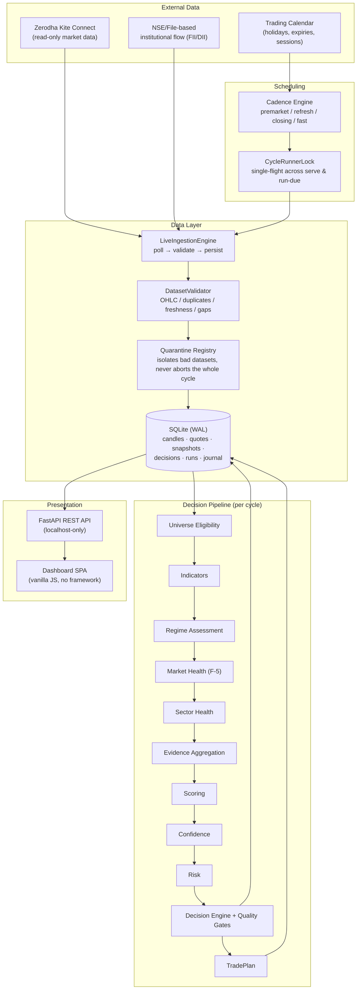
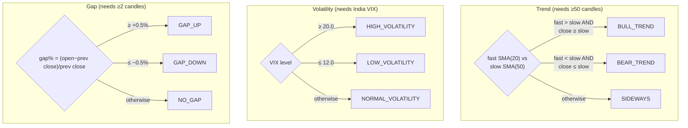
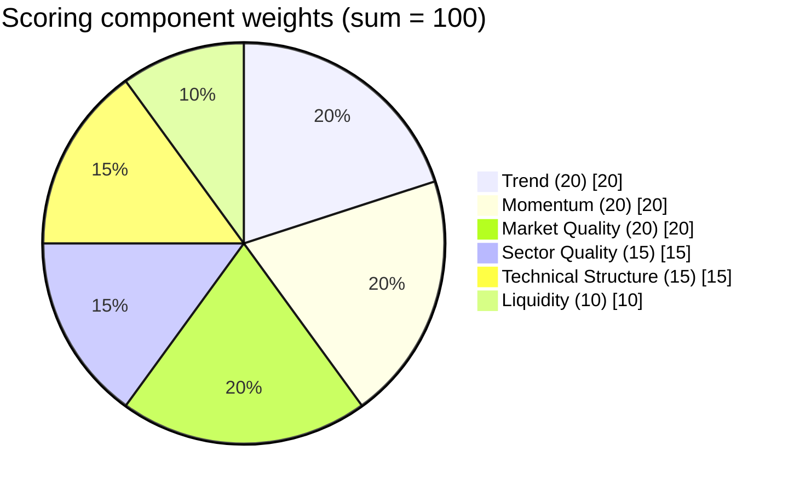
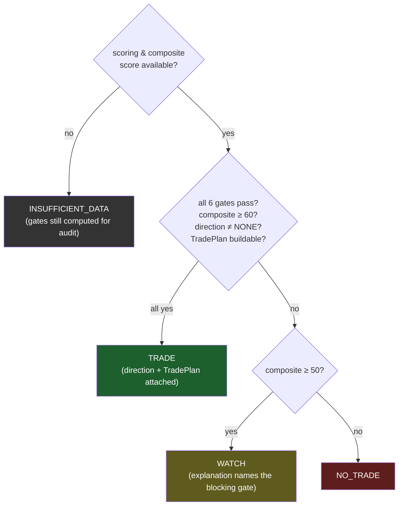
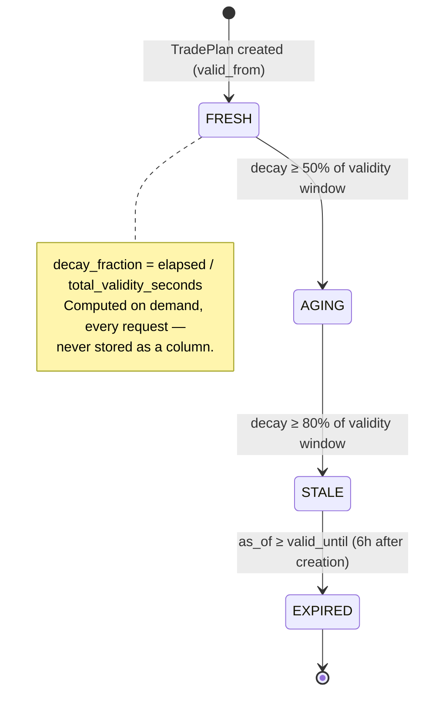
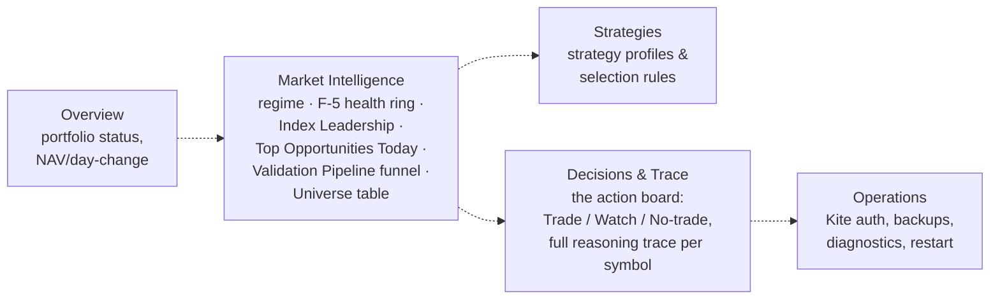

# ATHENA — End-to-End Workflow & Methodology

**A complete technical reference to what ATHENA is, how it thinks, and how to use it.**

This document explains ATHENA from first principles through to exact formulas: the philosophy, the full decision pipeline stage by stage with every threshold and weight currently in force, the scheduling model that keeps it fresh, the day-to-day dashboard workflow, and — because a "no gaps" document must be honest about gaps — an explicit accounting of what's fully implemented today versus what's declared in the architecture but not yet live.

Every number in this document is read from the actual, currently-loaded configuration files and code, not from design intent. Where a formula, threshold, or feature is **proposed but not implemented**, or **defined but dormant**, this document says so explicitly rather than describing aspirational behavior as fact.

---

## Table of Contents

1. [What ATHENA Is](#1-what-athena-is)
2. [System Architecture Overview](#2-system-architecture-overview)
3. [The Complete Decision Pipeline](#3-the-complete-decision-pipeline)
4. [Stage 1 — Universe Eligibility](#4-stage-1--universe-eligibility)
5. [Stage 2 — Indicators](#5-stage-2--indicators)
6. [Stage 3 — Regime Assessment](#6-stage-3--regime-assessment)
7. [Stage 4 — Market Health Score (F-5)](#7-stage-4--market-health-score-f-5)
8. [Stage 5 — Sector Health](#8-stage-5--sector-health)
9. [Stage 6 — Evidence Aggregation](#9-stage-6--evidence-aggregation)
10. [Stage 7 — Scoring](#10-stage-7--scoring)
11. [Stage 8 — Confidence](#11-stage-8--confidence)
12. [Stage 9 — Risk](#12-stage-9--risk)
13. [Stage 10 — Decision Engine & Quality Gates](#13-stage-10--decision-engine--quality-gates)
14. [Stage 11 — TradePlan Lifecycle](#14-stage-11--tradeplan-lifecycle)
15. [Position Sizing & Capital Policy](#15-position-sizing--capital-policy)
16. [Scheduling & Background Validation](#16-scheduling--background-validation)
17. [The Dashboard — Day-to-Day Workflow](#17-the-dashboard--day-to-day-workflow)
18. [Data Layer & Kite Integration](#18-data-layer--kite-integration)
19. [Governance & Non-Negotiables](#19-governance--non-negotiables)
20. [Known Gaps & Not-Yet-Implemented Behavior](#20-known-gaps--not-yet-implemented-behavior)
21. [Glossary](#21-glossary)
22. [Complete Configuration Reference](#22-complete-configuration-reference)

---

## 1. What ATHENA Is

ATHENA is a **single-user, advisory-only decision-intelligence platform** for one trader's NSE/BSE swing and intraday equity trading.

It is **not**:
- A screener (it doesn't just filter a list — it produces a full explained decision per symbol)
- A bot (it never acts on its own)
- An order-execution system (there is no order-placement code anywhere in the codebase, under any milestone, ever — a non-negotiable, enforced invariant)

It **is**:
- An ingestion + analytical pipeline that runs on a schedule (or on demand), pulling real market data, running it through a deterministic multi-stage decision pipeline, and persisting fully-explained `Decision` objects (TRADE / WATCH / NO_TRADE / etc.)
- A dashboard where the owner reviews those decisions, their full reasoning trace, and the market context behind them
- A record-keeper for what the owner actually did — journal entries (accept/reject/ignore) and manually-logged fills, so outcomes can be measured against what the system recommended

**The core philosophy:** the learning engine proposes, the trader approves. ATHENA computes and explains; the owner reads the brief, decides, and executes manually through their own broker.

---

## 2. System Architecture Overview



**Stack:** Python (Pydantic config, `Decimal` money, timezone-aware `datetime`), SQLite in WAL mode, FastAPI (bound to localhost only — ATHENA is never deployed remotely), a hand-rolled static-HTML + vanilla-JS dashboard (no frontend framework, no build step — [ADR-004](adr/ADR-004-static-html-first.md)), in-house technical indicators (no external TA-lib). Broker integration is Zerodha Kite Connect, read-only market data only — no order API is ever called.

---

## 3. The Complete Decision Pipeline

Every symbol that survives Universe Eligibility flows through exactly the same eleven-stage pipeline, once per validation cycle. Every stage is a **pure function of already-computed inputs plus an injected clock** — no stage reads the wall clock or makes an uncontrolled network call mid-computation, which is what makes a run fully replayable.


**The one rule that governs every stage:** if an input is missing or insufficient, the stage returns an **explicit unknown/absent state with a human-readable reason** — never a fabricated default, a silent zero, or an interpolated guess. This is [ADR-005 — Explainability as Data](adr/ADR-005-explainability-as-data.md): every artifact at every stage carries a mandatory, non-empty `explanation` field, enforced by the object's own constructor (`__post_init__` raises if it's missing) — not bolted on afterward by the API or dashboard. The presentation layer only ever *renders* an explanation that some engine already computed and persisted; it never reconstructs one.

The sections below document each stage's purpose, inputs, exact formula, outputs, and unknown-data handling, in pipeline order.

---

## 4. Stage 1 — Universe Eligibility

**Module:** `src/athena/universe/` · **Config:** `config/universe.json`

**Purpose.** Answers "which instruments are eligible for further analysis?" through independent, deterministic rules. It never ranks or selects what to trade — only excludes what genuinely can't be evaluated yet.

**Inputs:** every tracked `Instrument` (status/series/exchange), its persisted daily candles, the injected `as_of` clock, and optionally the trading calendar (for the completeness rule).

**The rules, evaluated per instrument, in order:**

| # | Rule | Condition | Current threshold |
|---|---|---|---|
| 1 | `active_status` | `instrument.status == "ACTIVE"` | — |
| 2 | `supported_series` | series in the allowed list | `["EQ", "BE"]` |
| 3 | `eligible_exchange` | exchange in the allowed list | `["NSE"]` |
| 4 | `data_present` | at least one candle exists | — |
| 5 | `min_history` | enough trading days of candles | **30 days** |
| 6 | `min_liquidity` | mean daily volume over the supplied window | **500,000 shares/day** |
| 7 | `data_completeness` *(optional — only runs if a calendar is supplied)* | fraction of expected trading sessions actually present | **≥ 90%** |

An instrument is `included` only if **every** evaluated rule passes. If rule 4 (`data_present`) fails, rules 5 and 6 are marked failed too, with the explicit reason `"not evaluable: no candle data"` — they are never silently skipped or defaulted to pass.

**Output:** a `Universe` (the included set, each member carrying a mandatory, non-empty `inclusion_trace` naming every rule it passed — "no unexplained inclusions") plus an `UniverseAssessment` for **every** evaluated instrument, included or not, with full per-rule evidence and an `eligibility_summary` string. A per-sector `(advances, declines)` breadth tally is also computed over included instruments only, from two-candle close comparisons.

**Feeds into:** every included instrument's `UniverseAssessment` becomes an `EvidenceItem` in the Evidence Aggregation stage; only instruments in the included set proceed to Indicators and beyond.

---

## 5. Stage 2 — Indicators

**Module:** `src/athena/indicators/` · **Config:** `config/indicators.json`

**Purpose.** "What does the data measure?" — deterministic technical indicators computed in-house (no external TA-lib) from candle data, with an explicit `UNKNOWN` status whenever history is insufficient. Measurement only — no interpretation, no signals.

Eight indicators are implemented, each with its exact formula and current config period:

| Indicator | Formula | Period(s) | Min. history needed |
|---|---|---|---|
| **SMA** | mean of trailing closes | 20 | 20 closes |
| **EMA** | seeded with SMA, then `EMA_t = (v_t − EMA_{t-1})·k + EMA_{t-1}`, `k = 2/(n+1)` | 21 | 21 closes |
| **RSI** | Wilder-smoothed avg gain/loss; `RSI = 100 − 100/(1+RS)`, `RS = avg_gain/avg_loss` | 14 | 15 closes |
| **ATR** | Wilder-smoothed True Range: `max(H−L, \|H−C_prev\|, \|L−C_prev\|)` | 14 | 15 candles |
| **MACD** | `EMA_fast(12) − EMA_slow(26)`; signal = `EMA_9` of that line; histogram = line − signal | 12/26/9 | 35 closes |
| **ADX** | Wilder directional-movement system → `+DI`, `−DI`, `ADX` | 14 | 29 candles |
| **Volume MA** | mean of trailing volumes | 20 | 20 bars |
| **VWAP** | session-reset: `Σ(typical_price·volume)/Σvolume`, `typical_price=(H+L+C)/3`; also reports `deviation_pct` from last close | — (today's session only) | any bars today |

Each result is wrapped as an `IndicatorResult{name, status: OK|UNKNOWN, values, evidence:{formula, inputs, explanation}}`. A structural invariant enforces that an `OK` result carries at least one value and an `UNKNOWN` result carries exactly zero — there is no code path that fabricates a value under an `UNKNOWN` label.

**Feeds into:** Scoring (momentum←RSI, liquidity←Volume MA, technical_structure←SMA/MACD/VWAP, trend←ADX) and the Decision Engine's `TradePlan` builder (ATR for stop/target distance, SMA for entry price).

---

## 6. Stage 3 — Regime Assessment

**Module:** `src/athena/regime/` · **Config:** `config/regime.json`

**Purpose.** Classifies the current market regime along three independent, always-labelled dimensions — descriptive only, never prescriptive.



Each dimension degrades to its own explicit `*_UNKNOWN` label (`TREND_UNKNOWN`, `VOLATILITY_UNKNOWN`, `GAP_UNKNOWN`) with an exact-count explanation when data is insufficient — 12 possible labels in total (4 per dimension).

**Output:** `RegimeResult` — 3 labels plus per-dimension evidence, each with a mandatory explanation and the raw inputs used.

**Feeds into:** Scoring's `trend` component (`BULL_TREND=80, SIDEWAYS=50, BEAR_TREND=20` points), Risk's volatility/gap dimensions, and — critically — the **Decision Engine's trade direction**: `BULL_TREND → LONG`, `BEAR_TREND → SHORT`, anything else → `NONE` (which alone blocks a `TRADE` decision regardless of how high the score is).

> **Dormant config note:** `regime.json` also defines `market_health_floor` and `sector_health_floor` (both = 40). Neither is read anywhere in the code today — the live market-quality gate actually uses a separate value, `decision.json`'s `market_floor` (also 40, by coincidence of current tuning, not by reference). These two fields are validated on load but currently inert.

---

## 7. Stage 4 — Market Health Score (F-5)

**Module:** `src/athena/market_health/` · **Config:** `config/market_health.json` · **Contract:** [`docs/design/F5-MARKET-HEALTH-SCORE.md`](design/F5-MARKET-HEALTH-SCORE.md)

This is the single number behind the dashboard's health ring — and the stage with the most important nuance in the whole pipeline: **two related but different engines share this package.**

1. A **categorical engine** (4 dimensions: breadth, trend_quality, momentum, volatility) — descriptive labels only, no numeric total.
2. The **F-5 numeric score** — 6 *different* components (trend_quality, breadth, liquidity, volatility, institutional_strength, gap_stability) combined into one weighted 0–100 total. Only three dimension names overlap between the two engines (trend_quality, breadth, volatility); F-5's `liquidity`, `institutional_strength`, and `gap_stability` don't exist in the categorical engine, and the categorical engine's `momentum` doesn't feed F-5 at all.

**The six F-5 components — bands, points, and weights (all from `config/market_health.json`):**

| Component | Weight | Bands → points | Absent (unavailable) when |
|---|---|---|---|
| **trend_quality** | 20 | consistency ≥0.65 STRONG(80) · ≤0.45 WEAK(20) · else MIXED(50) | fewer than 21 candles |
| **breadth** | 20 | advance ratio ≥0.60 strong(80) · ≤0.40 weak(20) · else mid(50) | universe coverage < 70%, or zero advances+declines |
| **liquidity** | 15 | median turnover ≥₹5cr healthy(80) · ≤₹1cr weak(20) · else mid(50) | fewer than **50** universe members have a computable turnover |
| **volatility** | 15 | VIX ≤12 calm(70) · ≥20 elevated(30) · else normal(55) | India VIX unavailable |
| **institutional_strength** | 15 | combined FII+DII (₹Cr): ≥2000 strong_buy(90) · 500–2000 mild_buy(70) · ≤−2000 strong_sell(10) · −2000..−500 mild_sell(30) · else balanced(50) | no session, or the session is more than **3 days old** (or future-dated) |
| **gap_stability** | 15 | stability ratio ≥0.80 strong(80) · ≤0.50 weak(20) · else mid(50) | fewer than 20 scored gap-days |

**The combining rule is strict:** if **any single** component is absent, the whole score is withheld — `total=None`, with a joined `unavailable_reason` string naming every absent component's own explanation. There is no partial score. When all six are present:

```
total = round( Σ(points[c] × weight[c]) / 100 )     — weighted mean, clamped to [0,100]
```

**Feeds into:** persisted as `detail["market_health_score"]` on the run; `ScoringEngine`'s `market_quality` component uses the F-5 `total` directly as its authoritative value; the Decision Engine's `MARKET` quality gate requires `market_quality ≥ 40` to allow a `TRADE`.

---

## 8. Stage 5 — Sector Health

**Module:** `src/athena/sector_health/` · **Config:** `config/sector_health.json`, `config/sector_index_mapping.json`

**Purpose.** "What is the condition of this sector?" — descriptive only, never ranks or selects. Computed from the sector's **proxy tracked index** (e.g. NIFTY IT), not from constituent stocks directly.

Only 8 sectors currently have an index mapping (others get no result at all — never guessed by name similarity):

| Sector | Proxy index |
|---|---|
| Information Technology | NIFTY IT |
| Automobile and Auto Components | NIFTY AUTO |
| Healthcare *(approximation)* | NIFTY PHARMA |
| Fast Moving Consumer Goods | NIFTY FMCG |
| Metals & Mining | NIFTY METAL |
| Realty | NIFTY REALTY |
| Oil Gas & Consumable Fuels *(approximation)* | NIFTY ENERGY |
| Power *(approximation)* | NIFTY ENERGY |

**Four dimensions**, same discipline of explicit `*_UNKNOWN` on insufficient history: trend (10/30-day SMA cross, needs 30 candles), breadth (advance ratio — see note below), momentum (10-day rate of change vs a **3.0%** bar, needs 11 candles), volatility (20-day realized standard deviation of returns vs 1.0%/2.5% bands, needs 21 candles).

> **Important, verified findings — read before assuming this feeds scoring:**
> - **Sector breadth is always `SECTOR_BREADTH_UNKNOWN` in production.** It requires a `constituent_breadth` input that the live pipeline never actually supplies (deferred to a future Universe Engine milestone).
> - **Sector Health does not currently feed Scoring or Decisions.** `ScoringEngine._sector_quality()` can accept it, but the live per-symbol scan never passes `sector_health` into either the scoring or decision call — so `sector_quality` is `UNKNOWN` in every live run today. Sector Health is computed and persisted purely for display.
> - **Sector Health does not feed "Index Leadership"** on the dashboard. That's a separate, computationally unrelated feature built on raw index price-change arithmetic (see §17) — the two happen to share the same sector→index config file, nothing more.
> - No numeric 0–100 sector score exists. A `SectorHealthScore` domain type mirroring the blueprint's momentum/leadership/relative-strength/participation/rotation composite is defined but never constructed anywhere.

---

## 9. Stage 6 — Evidence Aggregation

**Module:** `src/athena/evidence/`

**Purpose.** Gathers everything the prior stages produced into a single immutable, provenance-preserving `EvidenceBundle` — aggregation only, no scoring, no transformation, no interpretation.

Six evidence sources, each optional: `REGIME`, `MARKET_HEALTH`, `SECTOR_HEALTH`, `UNIVERSE`, `CORPORATE_ACTION`, `VALIDATION`. Whatever is supplied gets wrapped 1:1 into `EvidenceItem`s with the original object preserved verbatim as `payload` — nothing is lost or restated. A source that's simply `None` contributes zero items; it never gets fabricated.

**Output:** `EvidenceBundle{items, missing_sources, provenance, is_complete}` — `is_complete` is `True` only when every source the caller *required* is actually present.

**Feeds into:** the Decision Engine's `DATA` quality gate reads `bundle.is_complete` directly. Indicators and Scoring do **not** read the bundle — they consume the upstream objects (regime, market health, etc.) directly; the bundle's job is completeness bookkeeping and explainability, not a computational input.

> **Note on the frozen domain contract:** ATHENA's architecture defines a separate, more granular `Evidence`/`EvidenceCategory` schema (11 categories: TECHNICAL, PRICE_ACTION, VOLUME, VWAP, PATTERN, SECTOR, BREADTH, NEWS, RISK, PORTFOLIO, AI) as the eventual input to a fully evidence-driven Decision Engine. **No engine currently instantiates this object** — it is the frozen target contract, not yet wired into the live pipeline. Don't confuse it with the `EvidenceSource`/`EvidenceBundle` mechanism above, which *is* live.

---

## 10. Stage 7 — Scoring

**Module:** `src/athena/scoring/` · **Config:** `config/scoring.json`

**Purpose.** Transforms evidence and measurements into transparent component scores and a single composite — intermediate artifacts only, never a recommendation.

**Six components, weighted to sum to 100:**



| Component | Weight | Computation |
|---|---|---|
| **trend** | 20 | regime trend label → points (80/50/20) **+** ADX bonus (ramps 0→+10 pts as ADX goes 15→25) **+** multi-timeframe confluence bonus (up to +10 pts, proportional to agreement ratio) |
| **momentum** | 20 | RSI ramped linearly: 40→20 pts, 50→50 pts, 60→80 pts |
| **market_quality** | 20 | the F-5 total directly, when available (fallback: average of categorical market-health labels) |
| **sector_quality** | 15 | average of sector-health dimension labels (`UNKNOWN` in production today — see §8) |
| **liquidity** | 10 | Volume MA ramped 30→70 pts between 250,000 and 500,000 shares/day |
| **technical_structure** | 15 | 70 pts if above SMA else 30 · **+10 pts flat** if MACD histogram is positive · + VWAP-reclaim bonus (ramps 0→+10 pts as deviation above VWAP goes 0%→1.5%) |

**The composite is a weighted mean over only the *known* components**, not a division by a fixed 100:

```
composite   = Σ(component.value × weight)  over components with status OK
            ÷ Σ(weight)                    over the SAME OK components
completeness = (Σ weight of OK components) / 100
composite → UNKNOWN only if ALL SIX components are UNKNOWN
```

This re-normalization means a partially-unknown instrument's composite stays comparable on the same 0–100 scale as a fully-known one; `completeness` separately tracks how much of the weight was actually known — and that completeness number is exactly what the Decision Engine's `EVIDENCE` gate checks.

Every `OK` component is structurally required to carry at least one traceable `Contribution` (source, reference, points) — a scored value can never appear without a citation.

---

## 11. Stage 8 — Confidence

**Module:** `src/athena/confidence/` · **Config:** `config/confidence.json`

**Purpose.** Answers a completely different question from Scoring: **"how trustworthy is this evaluation?"** — never market direction, attractiveness, or risk.

**Six dimensions, weighted to sum to 100:**

| Dimension | Weight | Measures |
|---|---|---|
| Evidence Completeness | 20 | fraction of evidence sources present vs required |
| Indicator Availability | 20 | fraction of indicators that resolved (not `UNKNOWN`) |
| Data Freshness | 15 | pass rate of validation-type evidence |
| Cross-Engine Agreement | 15 | `100 − spread` across known scoring components (needs ≥2 known) |
| Unknown Ratio | 15 | `100 × (1 − unknown/total)` across scoring + indicators + evidence, combined |
| Consistency | 15 | penalizes divergence ≥40 pts between (trend, momentum) or (market_quality, sector_quality): −25 pts per contradicting pair |

Overall value = weighted mean over known dimensions (same re-normalization pattern as Scoring). **Level bands** — used identically for Confidence and Risk: `< 40` LOW, `40–69` MEDIUM, `≥ 70` HIGH.

**"High Conviction" — two unrelated meanings, don't conflate them:**
1. The dashboard's star rating on Top Opportunities cards is a **pure presentation rescale** of this engine's own `overall_value`: `stars = clamp(round(overall_value / 100 × 5), 1, 5)`. "High Conviction" there literally means `overall_level == HIGH` (≥ 70).
2. A **watchlist name**, `config/watchlist.json`'s `"High Conviction"` bucket, is a completely unrelated post-hoc classification of *decision outcomes* (`decision_type in [TRADE, INCREASE_POSITION]`) — nothing to do with the Confidence engine.

**Feeds into:** the Decision Engine's `CONFIDENCE` gate (`overall_value ≥ 50`).

---

## 12. Stage 9 — Risk

**Module:** `src/athena/risk/` · **Config:** `config/risk_assessment.json`

**Purpose.** Measures exposure/uncertainty, independent of opportunity. **Higher value means more risk** — the opposite direction from Score/Confidence, which is worth calling out since all three appear side by side on the dashboard.

**Six dimensions, weighted to sum to 100:**

| Dimension | Weight | Computation |
|---|---|---|
| Volatility Risk | 20 | regime volatility label → HIGH=80 / NORMAL=50 / LOW=20 |
| Liquidity Risk | 20 | Volume MA < 500,000 → 80, else 20 |
| Market Environment Risk | 20 | average of categorical market-health label points |
| Gap Risk | 15 | GAP_UP or GAP_DOWN → 70, NO_GAP → 20 |
| Event Risk | 15 | a calendar event → 80; weekly/monthly expiry → 70; else 20 |
| Concentration Indicator | 10 | fewer than 20 eligible universe symbols → 70 (concentrated), else 30 (diversified) |

Overall value = weighted mean over known dimensions; same LOW/MEDIUM/HIGH bands as Confidence. **Feeds into:** the Decision Engine's `RISK` gate (`overall_value ≤ 50`).

**Position sizing is a genuinely separate concern** (`src/athena/sizing/`) — pure quantity arithmetic over an *already-approved* capital allocation, with no market analysis of its own: `quantity = floor(allocated_amount / price)`, rounded down to whole shares. Capital policy (`config/capital.json`): total capital ₹10,00,000, 20% reserved, max 10% per position, max 30% per sector.

> **Not yet implemented:** [ADR-006](adr/ADR-006-circuit-limit-risk-signal.md) proposes a seventh risk dimension, `circuit_proximity_risk`, using Kite's daily circuit-limit fields. Status is **Proposed**, and verified not present in the running code — `Quote` carries no circuit-limit fields yet. `config/risk.json`'s daily-loss/consecutive-loss/no-trade circuit-breaker policy is schema-validated but no confirmed runtime enforcement point was found in this pass — treat as configured-but-unverified, not confirmed-live, until independently checked.

---

## 13. Stage 10 — Decision Engine & Quality Gates

**Module:** `src/athena/decision/` · **Config:** `config/decision.json`

This is where every prior stage converges into one deterministic decision.

### The canonical vocabulary — and what's actually live

Twelve decision types are declared as the canonical vocabulary ("R-6: exactly these twelve"):

```
TRADE · WATCH · WAIT · NO_TRADE · REDUCE_POSITION · INCREASE_POSITION ·
PARTIAL_EXIT · FULL_EXIT · AVOID_SECTOR · MARKET_CLOSED ·
INSUFFICIENT_DATA · DATA_VALIDATION_FAILED
```

**Only four of these twelve are producible by any engine in the codebase today: `TRADE`, `WATCH`, `NO_TRADE`, `INSUFFICIENT_DATA`.** The other eight are consumed downstream (Portfolio, Orders, and Allocation engines all branch on them; watchlist/strategy config classifies by them) but no engine constructs a `Decision` with any of them — they appear to be reserved vocabulary for a future position-aware decision layer, a sector-level pre-screen, and a session/data-validation pre-gate. This document treats them as declared-but-dormant rather than describing invented logic for how they might be chosen.

### The six quality gates

Every decision computes all six gates, always — regardless of the eventual outcome:

| Gate | Passes when | Threshold |
|---|---|---|
| `DATA` | the evidence bundle is complete | — |
| `EVIDENCE` | the composite score is known and its completeness ≥ 0.5 | 50% |
| `RISK` | overall risk ≤ 50 | 50 |
| `EXPLAINABILITY` | the composite score is known (then structurally always true) | — |
| `CONFIDENCE` | overall confidence ≥ 50 | 50 |
| `MARKET` | the market_quality score component ≥ 40 | 40 |

A missing upstream input makes its gate **fail explicitly** — never pass by default.

### The decision logic



Direction is derived purely from the regime's trend label: `BULL_TREND → LONG`, `BEAR_TREND → SHORT`, anything else → `NONE`. A `NONE` direction alone blocks `TRADE` no matter how high the score is.

**A hard domain invariant** (not just an engine-level check) forbids a `TRADE` decision from ever being constructed with a failed gate, a missing `TradePlan`, or a `NONE` direction — the `Decision` object's own constructor raises if this is violated, so this can't be bypassed by any calling code.

---

## 14. Stage 11 — TradePlan Lifecycle

Only `TRADE` decisions carry a `TradePlan`. Construction requires a known `ATR` and `SMA`, plus a non-`NONE` direction — if any of those is missing, no plan is built (and the decision degrades to `WATCH`/`NO_TRADE` based on the score alone).

**Exact construction** (`config/decision.json`):
```
stop_distance   = ATR × 1.5   (atr_stop_multiple)
target_distance = ATR × 3.0   (atr_target_multiple)

LONG:  stop = last_close − stop_distance,   target = last_close + target_distance
SHORT: stop = last_close + stop_distance,   target = last_close − target_distance

risk_reward = target_distance / stop_distance = 3.0 / 1.5 = 2.0   (always — a config-derived constant)
position_size = 1 unit   (provisional — NOT yet wired to the capital-based sizing engine)
valid_from = as_of,  valid_until = as_of + 6 hours   (validity_hours)
```

> **Precision notes:** `entry_low` and `entry_high` are both set to `last_close` — there's no entry-range logic despite the field names. `targets` holds exactly one price — no multi-target/scale-out ladder is implemented. `risk_reward` is a fixed 2.0 under current config, not a variable per-instrument ratio, since both distances scale off the same ATR value.

### The freshness state machine



This is computed **server-side**, authoritatively, on every request (`GET /decisions/{id}/plan-freshness`) — not just in the frontend. The dashboard's own JavaScript duplicates the same 0.5/0.8 thresholds as a display-only mirror; if the backend config ever changes, the frontend constant needs a matching manual update (there's no dynamic fetch of these thresholds today).

**There is no server-side "current vs. historical" stored field or query filter** — every decision's freshness is a derived value computed at request time against the caller's clock, never persisted as a column. The dashboard's board view computes this per-row to decide whether an expired-plan `TRADE` decision should still be shown as actionable (it isn't — expired-plan trades move to the audit/history view, keeping the live board an action list, not a log).

---

## 15. Position Sizing & Capital Policy

Deliberately downstream and decoupled from the analytical pipeline — sizing never influences scoring, confidence, risk, or the decision itself.

- `config/sizing.json`: whole-share lots only, rounded down (`WHOLE_SHARE` / `ROUND_DOWN`), 4-decimal internal precision.
- `config/capital.json`: total capital ₹10,00,000; 20% held in reserve; a single position may use at most 10% of capital; a single sector at most 30%.
- Explicit rejection outcomes exist for degenerate inputs — `REJECTED_ZERO_PRICE`, `ZERO_ALLOCATION` — never a silently-dropped order.

---

## 16. Scheduling & Background Validation

ATHENA runs its pipeline on a config-driven cadence, not a general-purpose job queue ([ADR-007](adr/ADR-007-owner-triggered-background-validation.md) explicitly rejected one) — reusing the same `CycleWorker`/`CycleRunnerLock` machinery everywhere, with a single-flight advisory lock ensuring `athena serve --with-cycles` and `athena run-due` (launchd/cron) can never run two cycles at once.

```mermaid
gantt
    dateFormat HH:mm
    axisFormat %H:%M
    title A trading day's cadence (illustrative)
    section Once per day
    PREMARKET before open   :milestone, m1, 08:15, 0m
    CLOSING after close     :milestone, m2, 15:45, 0m
    section Every session
    REFRESH full universe every 15 min :active, refresh, 09:15, 375m
    section Owner opt in
    FAST decision list only every 5 min :fastrun, 09:15, 375m
```



| Trigger | Cadence | Scope | Fetches daily candles? |
|---|---|---|---|
| **PREMARKET** | once/day, 08:15, before market open | full owner candidate universe | yes |
| **REFRESH** | every 15 min while the session is open (09:15–15:30) | full universe | yes |
| **CLOSING** | once/day, at/after 15:45 and session close | full universe | yes |
| **FAST** *(opt-in)* | every 5 min while the session is open | only symbols with a current decision, capped at 400, single 5-minute timeframe | **no** — REFRESH already keeps daily candles correct; FAST exists purely to keep intraday/decision freshness tighter between full cycles without competing for the same rate-limited Kite historical endpoint |

Every trigger is suppressed entirely on a non-trading day (weekend/holiday), determined via the trading calendar — not just wall-clock time-of-day, since Kite's own quotes are legitimately frozen at the last real close on a closed day.

**Reliability model:** a single symbol with a stale or invalid dataset is quarantined and skipped individually — it no longer aborts the entire cycle and discards every other symbol's already-fetched, already-valid data. This is visible, not hidden: the persisted run record carries a `datasets_quarantined` count and the exact dataset IDs skipped.

**On-demand validation**, distinct from the scheduled cadences above, is available two ways: the dashboard's "Revalidate" action (up to 20 symbols, synchronous), and an owner-triggered full-universe background validation job (single-flight, progress-polled) — both reuse the exact same scoped-ingest-then-score mechanics as the scheduled cycles.

---

## 17. The Dashboard — Day-to-Day Workflow

Five tabs, each backing a distinct part of the trader's actual workflow:



- **Overview** — portfolio status: cash, positions, NAV trend, day change.
- **Market Intelligence** — the market-wide picture: the regime/F-5 health ring (§7), Index Leadership (real index price-change ranking — computationally independent of Sector Health, see the note in §8), Top Opportunities Today (sector-ranked, highest-conviction qualified symbols, each with a "Revalidate" and "Open decision" action), the Validation Pipeline funnel (Universe → Eligible → Filtered → Watch → Trade counts for the day), and the Universe table (every tracked instrument's eligibility state).
- **Strategies** — which strategy profile is active and its selection rules.
- **Decisions & Trace** — the actual working surface: a left-hand action board grouped by decision type (expired-plan `TRADE`s are excluded from the live board — they move to history, keeping this a current action list, not an audit log), a center detail panel with five tabs (**Trade Plan**, **Analysis**, **Market Context**, **Response**, **History**), and a right-hand Reasoning Trace panel that lets the owner click any pipeline stage to jump straight to where that value lives in the brief. The board and the header ticker auto-refresh every 60 seconds while the tab is open — no manual refresh needed to see newly-persisted decisions.
- **Operations** — Kite session status and re-auth flow, database backups/restore, diagnostics, and a server restart control.

**The owner's actual response to a decision is recorded, not inferred**: the "Response" tab lets the owner mark a decision `ACCEPTED` / `REJECTED` / `IGNORED` with notes, and — for accepted decisions the owner actually took — log the realized entry/exit fill. PnL and plan adherence are computed server-side from the persisted `TradePlan`, never client-supplied, so every recorded outcome is deterministic and independently reconstructible.

---

## 18. Data Layer & Kite Integration

**Ingestion** (`LiveIngestionEngine`) runs one cycle at a time: fetch daily candles (if scoped), fetch intraday candles for each configured timeframe, fetch quotes (batched — up to 500 instruments per single Kite call), fetch a market snapshot (index levels, VIX, breadth), and optionally institutional flow (FII/DII, once per session). Every fetched dataset is validated (OHLC sanity, duplicate detection, freshness vs. the trading calendar, gap detection) before being written; a failing dataset is quarantined and skipped, not silently accepted or allowed to abort the whole cycle.

**Persistence** is a single SQLite file in WAL mode. Daily candles for the still-forming trading day are deliberately re-fetched and overwritten on every cycle until the session closes (an intraday quote of "today's candle" is not final until the close print settles) — closed prior days are never re-touched, since their close is immutable.

**Kite rate limits** (from `config/providers/kite.json`, respected by the transport layer automatically): historical candle calls ≈ 3/second (0.334s minimum interval, applied per symbol), quote calls batch up to 500 symbols per request at 1/second, everything else at 10/second. This is why the FAST cadence (§16) deliberately excludes daily candles and caps its symbol count — a full-universe historical re-fetch every few minutes would both exceed what's useful and compete with the regular cadence for the same rate-limited endpoint.

**Provider independence** ([ADR-002](adr/ADR-002-broker-abstraction.md), [ADR-008](adr/ADR-008-institutional-flow-provider.md)): business logic never imports a concrete broker or data-vendor class directly — everything goes through a `MarketDataProvider`/`InstitutionalFlowProvider` Protocol, so a file-based fixture provider and the live Kite provider are interchangeable in every engine and every test.

---

## 19. Governance & Non-Negotiables

These are frozen, non-negotiable invariants — not conventions that can be relaxed for convenience:

- **No order-placement code exists anywhere in this repository**, under any milestone, ever — not a flag, not a future stub, not behind a feature toggle.
- **Every number ATHENA shows is explainable**, and that explanation is computed and *persisted as data* by the engine that produced the value ([ADR-005](adr/ADR-005-explainability-as-data.md)) — the API and dashboard render only; they never reconstruct or recompute a rationale after the fact.
- **Deterministic and replayable.** Injected clocks (no `datetime.now()` inside analytical engines), `Decimal` money, timezone-aware timestamps throughout, no hidden state, no unseeded randomness.
- **Provider independence.** Broker and market-data concerns sit behind Protocol abstractions; institutional cash-flow is its own separate Protocol.
- **Architecture is frozen.** The system blueprint is the single source of truth for module boundaries; a genuine architectural limitation is resolved by writing an ADR and waiting for explicit approval — never by silently working around it.
- **Secrets live only in `.env`** (gitignored) — never in a committed config file.

---

## 20. Known Gaps & Not-Yet-Implemented Behavior

A "no gaps" document has to be honest about *actual* gaps between the declared architecture and the live code, verified by direct inspection rather than assumed from documentation intent:

1. **8 of the 12 canonical `DecisionType` values are never produced by any engine today** — only `TRADE`, `WATCH`, `NO_TRADE`, `INSUFFICIENT_DATA` are live (§13). `WAIT`, `REDUCE_POSITION`, `INCREASE_POSITION`, `PARTIAL_EXIT`, `FULL_EXIT`, `AVOID_SECTOR`, `MARKET_CLOSED`, and `DATA_VALIDATION_FAILED` are consumed downstream but never constructed.
2. **Circuit-limit risk (ADR-006) is proposed, not implemented.** No `circuit_proximity_risk` risk dimension and no circuit-limit fields on `Quote` exist in the running code yet.
3. **Sector Health does not feed Scoring or Decisions in production**, despite the scoring engine being able to accept it — the live scan path never supplies it, so `sector_quality` is `UNKNOWN` in every real run today (§8, §10). It's computed purely for dashboard display.
4. **Sector breadth is always `SECTOR_BREADTH_UNKNOWN`** in production — the constituent-level breadth input it needs is deferred to a future Universe Engine milestone.
5. **`config/risk.json`'s daily-loss / consecutive-loss / no-trade circuit-breaker policy** is schema-validated on load, but no confirmed runtime enforcement point was found during this pass — treat as configured, not confirmed-enforced, pending a direct verification.
6. **The frozen `Evidence`/`EvidenceCategory` domain contract** (11 categories, the eventual input to a fully evidence-driven Decision Engine) is defined but never instantiated by any live engine — the actual live evidence mechanism is the coarser `EvidenceSource`/`EvidenceBundle` pipeline described in §9.
7. **`TradePlan.risk_reward` is a fixed constant (2.0)** under current config — both the stop and target distances scale off the same ATR value, so it is not a variable, instrument-specific ratio despite superficially resembling one.
8. **`config/universe.json`'s `include_index_constituents` and `custom_symbols` fields are validated but never read** by the Universe engine — currently inert, likely reserved for a future universe-seeding capability distinct from candidate seeding.

None of these are correctness bugs — they are architecture that has been deliberately staged milestone by milestone, per this project's own phase discipline. They're listed here so this document never implies more is live than actually is.

---

## 21. Glossary

| Term | Meaning |
|---|---|
| **Composite score** | Scoring engine's single 0–100 weighted-mean output across its six components |
| **Confidence** | How trustworthy the current evaluation is (data completeness/agreement) — *not* a prediction of outcome |
| **Decision** | The terminal, persisted artifact of one pipeline run for one instrument: a type, a direction, gate results, and (if `TRADE`) a `TradePlan` |
| **Evidence Bundle** | The provenance-preserving aggregate of every upstream artifact for one cycle |
| **F-5** | The Market Health Score's six-component numeric contract |
| **Quality Gate** | One of six pass/fail checks (`DATA`, `EVIDENCE`, `RISK`, `EXPLAINABILITY`, `CONFIDENCE`, `MARKET`) that a `TRADE` decision must clear every one of |
| **Regime** | The market's current trend/volatility/gap classification |
| **Risk** | Exposure/uncertainty score — higher is riskier, independent of opportunity |
| **TradePlan** | Entry/stop/target/validity window attached only to `TRADE` decisions |
| **Universe** | The set of instruments that currently pass all eligibility rules |

---

## 22. Complete Configuration Reference

Every numeric threshold cited in this document, by file, for quick lookup:

| File | Key | Value |
|---|---|---|
| `universe.json` | min_avg_daily_volume | 500,000 |
| `universe.json` | min_trading_history_days | 30 |
| `universe.json` | min_history_completeness | 0.9 |
| `indicators.json` | sma / ema / rsi / atr / volume_ma periods | 20 / 21 / 14 / 14 / 20 |
| `indicators.json` | macd fast/slow/signal | 12 / 26 / 9 |
| `indicators.json` | adx period | 14 |
| `regime.json` | trend_ma_fast / trend_ma_slow | 20 / 50 |
| `regime.json` | high_volatility_vix / low_volatility_vix | 20.0 / 12.0 |
| `regime.json` | gap_pct_threshold | 0.5% |
| `market_health.json` | breadth strong/weak/min_coverage | 0.60 / 0.40 / 0.70 |
| `market_health.json` | liquidity min_members / healthy / weak turnover | 50 / ₹5cr / ₹1cr |
| `market_health.json` | institutional max_age_sessions | 3 sessions |
| `market_health.json` | weights (sum 100) | trend_quality 20, breadth 20, liquidity 15, volatility 15, institutional 15, gap 15 |
| `sector_health.json` | trend / momentum / volatility windows | 30 / 11 / 21 candles |
| `scoring.json` | weights (sum 100) | trend 20, momentum 20, market_quality 20, sector_quality 15, technical_structure 15, liquidity 10 |
| `confidence.json` | weights (sum 100) | 20/20/15/15/15/15 |
| `confidence.json` | level bands | <40 LOW, 40–69 MEDIUM, ≥70 HIGH |
| `risk_assessment.json` | weights (sum 100) | 20/20/20/15/15/10 |
| `decision.json` | min_composite_for_trade / watch_composite | 60 / 50 |
| `decision.json` | min_confidence_for_trade / max_risk_for_trade | 50 / 50 |
| `decision.json` | min_evidence_completeness / market_floor | 0.5 / 40 |
| `decision.json` | atr_stop_multiple / atr_target_multiple | 1.5 / 3.0 |
| `decision.json` | validity_hours | 6 |
| `decision.json` | freshness_warn / stale fraction | 0.5 / 0.8 |
| `sizing.json` | model / rounding | WHOLE_SHARE / ROUND_DOWN |
| `capital.json` | total_capital / reserved / max per-position / max per-sector | ₹10,00,000 / 20% / 10% / 30% |
| `scheduling.json` | refresh interval | 15 min |
| `scheduling.json` | fast interval / max_symbols | 5 min / 400 |
| `providers/kite.json` | historical / quote batch / other rate limits | 3/s · 500/batch @ 1/s · 10/s |

---

*This document reflects the codebase as of 2026-08-07. Every threshold above is read from the actual configuration files, not from design intent — if a value in production config changes, this table should be regenerated alongside it.*
</content>
